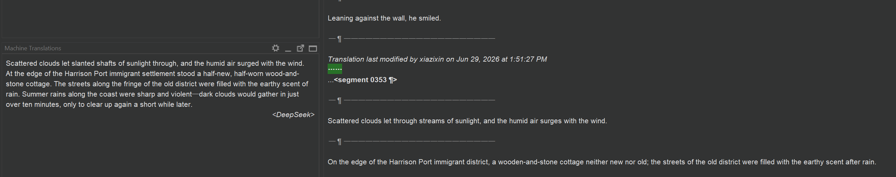

# DeepSeek OmegaT Plugin 

This plugin adds DeepSeek as a machine translation provider in OmegaT.

## Features

- Registers a DeepSeek translation engine inside OmegaT.
- Sends requests to the OpenAI-compatible DeepSeek chat completions API.
- Configurable model selection, temperature, and dynamic temperature.
- **Glossary support** — automatically reads OmegaT project glossaries and passes matching entries (with comments) to the AI as translation hints.
- **Context segments** — optionally sends surrounding segments (above/below) to the AI for better continuity and tone consistency across sentences.

## Requirements

- OmegaT 6.0 or newer.
- A DeepSeek API key.

## Build

From the project root, run:

```bash
./gradlew build
```

On Windows, use:

```bat
gradlew.bat build
```

The plugin JAR is written to `build/libs/`.

## Install into OmegaT

1. Copy the generated JAR from `build/libs/` into OmegaT's plugin directory.
2. Restart OmegaT.

## Configuration

Open OmegaT's machine translation settings and configure the DeepSeek engine.

| Setting | Default | Description |
|---|---|---|
| API key | *(none)* | Your DeepSeek API key, stored in OmegaT credentials |
| Model | `deepseek-v4-flash` | `deepseek-v4-flash` (faster, cheaper) or `deepseek-v4-pro` (slower, more refined) |
| Temperature | `0.3` | Slider 0.0–2.0 in 0.1 steps. Fades (greys out) when Dynamic Temperature is on — stays visible so you can still see the base value. |
| Dynamic Temperature | Off | When enabled, lets the API auto-adjust temperature — the slider is ignored |
| Glossary | None | **None** — glossary disabled. **Reference** — glossary entries are sent as hints; the AI uses judgment and won't blindly override compound terms (e.g. `白金色` stays `platinum color` even with `金色 → gold color` in the glossary). **Strict** — glossary entries must be used exactly. |
| Context segments | 0 | Number of surrounding segments (above and below) to include as context. 0 = disabled, up to 3. Helps AI maintain narrative continuity and tone. |
| Context char limit | 400 | Max characters per context segment before truncation. Options: 200, 400, 600, 800, 1000, or No limit. Adjust based on your segment size. |

You can also override settings with system properties:

- `deepseek.api.key`
- `deepseek.api.model`
- `deepseek.api.url`

## Glossary Files

When glossary mode is set to **Reference** or **Strict**, the plugin reads standard OmegaT glossary files (`.txt`, `.csv`, `.tab`, `.utf8`) from your project's `glossary` folder. Each line should be tab-separated:

```
source term → target term → comment (optional)
```

Only entries whose source term appears in the current segment are included in the prompt (up to 20, sorted by specificity).

## Context Segments

When set to a value greater than 0, the plugin includes up to N segments above and below the current segment as context in the system prompt. This helps the AI:

- Maintain consistent tone and style across sentences
- Understand narrative flow (especially for novel/creative translation)
- Produce more natural transitions between segments

**Segments above** include both the source text *and* the user's actual stored translation from OmegaT (shown as `SRC → TRG`). This means if you manually edit a translation, the AI sees your corrected version — not its own raw output. Falls back to the plugin's own cached output if no stored translation exists yet.

Context segments are truncated to the configured character limit (200–1000, or no limit). Adjust based on your typical segment size — higher values for paragraph-level segmentation, lower for sentence-level. Default is 400 characters.

## Notes

- The plugin sends only the translated text back to OmegaT.
- The translation prompt asks the API to preserve tags, placeholders, and line breaks.
- In **Reference** glossary mode, glossary entries are sent as contextual hints — the AI is instructed to use judgment and not blindly apply partial matches (e.g., compound words containing a glossary term won't be incorrectly split).
- Context segments are looked up from the project's ordered entry list using sequential position tracking for efficiency.
- When no OmegaT project is open, glossary and context features are silently skipped with no errors.

## Known Issues

- **Context segments + ellipsis segments**: When **Context segments** is set greater than 0 and the current source segment consists only of punctuation/ellipsis (e.g., `......`), there is a small chance the API will return translations for the *next* few segments instead of the current one. This occurs because the model misidentifies the ellipsis as a scene break or continuation marker when context is provided.

  

  **Workaround**: temporarily set Context segments to 0 when translating isolated punctuation segments, or manually correct the output after translation.

## Changelog

### v1.4.1
- Configurable context character limit (200/400/600/800/1000/No limit) instead of hardcoded 200
- Temperature slider fades (greys out) instead of hiding with Dynamic Temperature

### v1.4.0
- **Context segments** — send surrounding segments (above/below) to the AI for narrative continuity
- **Stored translation awareness** — context above uses OmegaT's actual stored translations (user edits respected), not just raw MT output
- Temperature slider now **fades** (greys out) when Dynamic Temperature is enabled instead of disappearing
- Sequential position tracking for efficient context lookups during batch translation

### v1.3.0
- **Glossary mode selector** — None / Reference / Strict
- Glossary comments passed to AI as context
- Smart glossary matching (only current-segment terms, sorted by specificity)

### v1.2.1
- Dynamic temperature toggle and scaling

### v1.2.0
- Temperature slider in settings (default 0.3)

### v1.1.0
- Model dropdown selector (DeepSeek V4 Pro / Flash)

### v1.0.0
- Initial release
