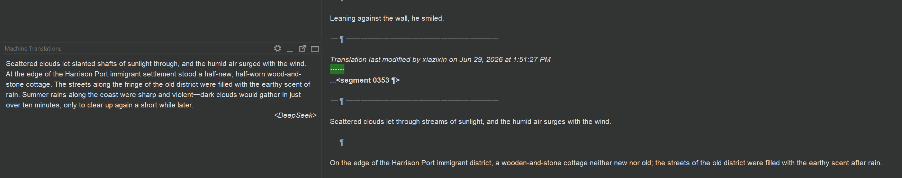

# DeepSeek OmegaT Plugin 

This plugin adds DeepSeek as a machine translation provider in OmegaT.

**Documentation:** <https://xiaz.dev/documentation/deepseek-omegat-plugin/> — setup, configuration reference, and guides for glossaries, context segments, work tags, auto mode and the self-review pass.

## Features

- Registers a DeepSeek translation engine inside OmegaT.
- Sends requests to the OpenAI-compatible DeepSeek chat completions API.
- Configurable model selection, temperature, and dynamic temperature.
- **Glossary support** — automatically reads OmegaT project glossaries and passes matching entries (with comments) to the AI as translation hints.
- **Context segments** — optionally sends surrounding segments (above/below) to the AI for better continuity and tone consistency across sentences.
- **Context chaining** — ordered, append-only chain of previous segments (`seg 1, 2, 3…` with your stored translations) built into every prompt. Grows only in order, keeps the prompt prefix stable for DeepSeek's context cache.
- **Auto-insert** — when active, automatically fills the target segment with the machine translation result, eliminating the need to press Ctrl+M for every segment.
- **Auto-confirm** — when active, also commits the translation and advances to the next segment (use with caution).
- **Auto-glossary** — the AI suggests key terminology pairs alongside each translation, including optional usage comments. Entries saved to `deepseek_auto_glossary.txt`.
- **Self-review agent** — a second AI pass reviews each translation for tag preservation, glossary consistency, accuracy, and fluency — correcting errors automatically.
- **Work tags** — identify the novel to the AI: source author, title, tags, and labels saved to `deepseek_tags.txt` in the project folder and included in every prompt. Edit via the **Additional tags...** button in the MT settings dialog.
- **Hotkey toggle** — press **Ctrl+Shift+M** anytime to turn auto-mode on/off. Settings define what auto-mode does; the hotkey just switches it.
- **⚡ AUTO indicator** — persistent status bar indicator shows when auto-mode is active.


## Requirements

- OmegaT 6.0 or newer.
- A DeepSeek API key.

## Build

From the project root, run:

```bash
./gradlew build
```

On Windows, use:

```bat
gradlew.bat build
```

The plugin JAR is written to `build/libs/`.

## Install into OmegaT

1. Copy the generated JAR from `build/libs/` into OmegaT's plugin directory.
2. Restart OmegaT.

## Configuration

Open OmegaT's machine translation settings and configure the DeepSeek engine.

| Setting | Default | Description |
|---|---|---|
| API key | *(none)* | Your DeepSeek API key, stored in OmegaT credentials |
| Model | `deepseek-flash` | `deepseek-flash` (V4.1 Flash — latest, faster, cheaper) or `deepseek-v4-pro` (V4 Pro — being retired; the API routes it to V4.1 Flash after 2026-09-14) |
| Reasoning | Off | Slider below the model selector, Faster ↔ Smarter: off / minimal / low / medium / high / extra high / maximum. Sent as `"reasoning": {"effort": ...}` — the stops collapse onto the 4 API modes: off→`none`, minimal/low→`low`, medium/high→`high`, extra high/maximum→`max`. |
| Temperature | `0.3` | Slider 0.0–2.0 in 0.1 steps. Fades (greys out) when Dynamic Temperature is on — stays visible so you can still see the base value. |
| Dynamic Temperature | Off | When enabled, lets the API auto-adjust temperature — the slider is ignored |
| Glossary | None | **None** — glossary disabled. **Reference** — glossary entries are followed by default; the AI may override an entry only when using it literally would cause a factual, grammatical, or stylistic error (e.g. `白金色` stays `platinum color` even with `金色 → gold color` in the glossary) — never for preference or variety. **Strict** — glossary entries must be used exactly. |
| Context segments | 0 | Number of surrounding segments (above and below) to include as context. 0 = disabled, up to 3. Helps AI maintain narrative continuity and tone. |
| Context char limit | No limit | Max characters per context segment before truncation. Options: 200, 400, 600, 800, 1000, or No limit. Adjust based on your segment size. |
| Context chaining | Off | Ordered, append-only chain of previous segments (`seg 1, 2, 3…` with your stored translations). Replaces the `[Above]` context format; segments below still follow **Context segments**. |
| Chain length | 100 | Max previous segments kept in the chain: 25, 50, 100, 200, or No limit. When full, the chain resets (one cache break) and regrows from the current segment. |

You can also override settings with system properties:

- `deepseek.api.key`
- `deepseek.api.model`
- `deepseek.api.url`

## Glossary Files

When glossary mode is set to **Reference** or **Strict**, the plugin reads standard OmegaT glossary files (`.txt`, `.csv`, `.tab`, `.utf8`) from your project's `glossary` folder. Each line should be tab-separated:

```
source term → target term → comment (optional)
```

Only entries whose source term appears in the current segment are included in the prompt (up to 20, sorted by specificity).

## Context Segments

When set to a value greater than 0, the plugin includes up to N segments above and below the current segment as context in the system prompt. This helps the AI:

- Maintain consistent tone and style across sentences
- Understand narrative flow (especially for novel/creative translation)
- Produce more natural transitions between segments

**Segments above** include both the source text *and* the user's actual stored translation from OmegaT (shown as `SRC → TRG`). This means if you manually edit a translation, the AI sees your corrected version — not its own raw output. Falls back to the plugin's own cached output if no stored translation exists yet.

Context segments are truncated to the configured character limit (200–1000, or no limit). Adjust based on your typical segment size — higher values for paragraph-level segmentation, lower for sentence-level. Default is No limit.

## Context Chaining

When **Context chaining** is enabled, the plugin builds an ordered, append-only chain of previously translated segments into every system prompt, instead of the sliding `[Above]` window:

```
Previous segments
seg 1 : <source>  →  <your stored translation>
seg 2 : <source>  →  <your stored translation>
seg 3 : <source>  →  <your stored translation>

Current segment: segment 4 below

Segment below for reference (DO NOT translate these — only the current segment):
<source of segment 5>
...
```

The rules:

- **Grows only in order** — translating segments 1 → 2 → 3 appends each one as you move forward. A segment joins the chain only when every segment before it (back to the chain's start) is translated.
- **Added after your edits, not after the AI replies** — entries come only from translations **stored in the OmegaT project** (committed via Ctrl+Enter, saved when you navigate away, or committed by auto-confirm), i.e. your final edited text. A raw AI suggestion that was never stored never enters the chain.
- **Jumps don't extend the chain** — if you jump from segment 3 to segment 5 (skipping 4), the prompt for segment 5 still shows the existing chain (seg 1–3) but the chain does not grow across the gap. Segment 5 joins only after you translate segment 4 — then both backfill automatically as you continue forward.
- **Frozen entries** — each line is fixed the moment it is appended. Going back and editing an already-chained segment does NOT rewrite the chain, so the prompt prefix never changes mid-run.
- **KV-cache friendly** — because the chain only ever appends (never reorders, slides, or rewrites), the prompt prefix stays byte-identical between requests and DeepSeek's context cache keeps hitting: each new segment costs only its own tokens plus one new chain line. When the chain hits the **Chain length** cap it resets once and regrows from the current segment — never a sliding window, which would break the cache on every request.

Segments below the current one (source only, "DO NOT translate") still follow the **Context segments** count, and both chain lines and below segments respect the **Context char limit** truncation. Segment numbers are 1-based positions in the project's ordered entry list, so the AI can see a gap when you skipped segments.

**Moving between files in the same project:** the chain is indexed by position in the project-wide entry list, not per file — so it is never reset by switching files. Moving from the last segment of one file to the first segment of the next is just a normal in-order step: the chain grows right across the boundary and numbering continues (the next file starts at e.g. `seg 101`, not `seg 1`), which keeps the previous file's tail as context when you start a new one. Jumping back to an earlier file also keeps the chain fully intact — the prompt simply renders the chain prefix up to that segment, and growth resumes when you move forward again.

**The chain resets only when:** you open a different project (or reopen the current one), confirm the MT settings dialog, hit the **Chain length** cap (one reset, then regrowth), or restart OmegaT — the chain is session memory only and is never written to disk.

**Caveats:** position lookup works by source-text equality, so if the identical sentence appears in more than one file, a jump may resolve to the wrong copy for that segment. Also, the entry list is snapshotted when the project is opened — adding or removing files mid-session won't renumber segments until you reopen the project.

## Notes

- The plugin sends only the translated text back to OmegaT.
- The translation prompt asks the API to preserve tags, placeholders, and line breaks.
- In **Reference** glossary mode, glossary entries are followed by default — the AI may only deviate when literal use would cause a factual, grammatical, or stylistic error (e.g., a compound word containing a glossary term must not be split), never for preference or variety.
- Context segments are looked up from the project's ordered entry list using sequential position tracking for efficiency.
- When no OmegaT project is open, glossary and context features are silently skipped with no errors.

## Known Issues

- **Context segments + ellipsis segments**: When **Context segments** is set greater than 0 and the current source segment consists only of punctuation/ellipsis (e.g., `......`), there is a small chance the API will return translations for the *next* few segments instead of the current one. This occurs because the model misidentifies the ellipsis as a scene break or continuation marker when context is provided.

  

  **Workaround**: temporarily set Context segments to 0 when translating isolated punctuation segments, or manually correct the output after translation.

## Changelog

### 1.7.0
- **New: Context chaining** — ordered, append-only chain of previous segments (`seg 1 : src → trg`, `seg 2 : …`) built into every system prompt, replacing the sliding `[Above]` window when enabled. Entries come only from translations stored in the OmegaT project (your edited text — raw AI replies never enter the chain), grow only in order, never extend across an untranslated gap (jumping 3 → 5 keeps the chain but can't extend it; segment 5 joins only after segment 4 is translated), and are frozen at append time — so the prompt prefix stays byte-stable and DeepSeek's context cache keeps hitting. New **Chain length** setting (25/50/100/200/No limit, default 100): on overflow the chain resets once and regrows instead of sliding. Segments below still follow **Context segments**; truncation still follows **Context char limit**.
- **Changed: Context char limit default** — now **No limit** (was 400). If you previously confirmed the settings dialog, your stored value is kept — set it to No limit once to opt in.

### 1.6.2
- **New: DeepSeek V4.1 Flash model** — the latest DeepSeek model, called in the API as `deepseek-flash`, is now the default (see the [V4.1 Flash announcement](https://api-docs.deepseek.com/zh-cn/news/news260910)). The retired `deepseek-v4-flash` was removed from the selector (the API temporarily routes it to V4.1 Flash). `deepseek-v4-pro` remains selectable, but DeepSeek is sunsetting it — requests are routed to V4.1 Flash after 2026-09-14.

### 1.6.1
- **New: Work tags** — identify the source work to the AI. The MT settings dialog has an **Additional tags...** button that opens an editor (source author, source title, source tags, generic labels, blank tags); **Create / update tags** writes `deepseek_tags.txt` into the project folder, and the tags are injected into every translation prompt.
- **New: Reasoning slider** — below the model selector, Faster ↔ Smarter with stops off / minimal / low / medium / high / extra high / maximum (default off). Sent as `"reasoning": {"effort": ...}`, collapsing onto the 4 API modes (none/low/high/max). Applies to the self-review pass too. (Currently for trobleshooting function So I dont have to make an independent dev build like before.)

### 1.6.0
- **New: DeepSeek top menu** — a dedicated top-level menu in the OmegaT menu bar for additional plugin functions.
- **New: Raw response log** — menu toggle that appends every raw DeepSeek API response body (untouched JSON) to `deepseek_raw.log` in the OmegaT configuration folder. The file contains only raw responses; the menu also offers open/clear. (the build in log is too hard to read for me)
- **New: Current prompts viewer** — menu item showing the most recent request sent to the DeepSeek API (parameters, system prompt, and user message) with real line breaks in a scrollable dialog. (still mostly dev funtions, but it can give you an clear picture as well)
- **Changed: Reference glossary mode** — entries are now followed by default; the AI may override an entry only when using it literally would cause a factual, grammatical, or stylistic error — never for preference or variety. (glossary reference mode should be stricter)
- **Fixed: Auto-glossary dedup** — now checks all glossary files in the project's glossary folder (not just `deepseek_auto_glossary.txt`), re-read on every save so mid-session edits are respected, and synchronized against concurrent translation threads. (now it checks for duplicates for both files instead of one)

### 1.5.3
- **Fixed: Editor freeze** — `translationCache` (LinkedHashMap with access-order) was not thread-safe. Concurrent `get()`/`put()` from multiple OmegaT worker threads corrupted the internal linked list, causing infinite loops. Wrapped with `Collections.synchronizedMap()`.
- **Changed: Hotkey debouncing** — Ctrl+Shift+M now ignores OS auto-repeat events and enforces a 400ms minimum between toggles, preventing EDT flooding when keys are held down.
- **Removed: Auto-stop on manual click** — the entry-listener state machine (`expectingAutoActivation`/`lastAutoEntryNum`) was removed because it caused EDT re-entrancy issues. Use Ctrl+Shift+M to stop auto-mode instead.

### 1.5.2
- **Fixed: Cached translation insertion** — when auto-mode is toggled ON via Ctrl+Shift+M, the already-generated MT result is inserted directly from cache (no redundant API call).
- **Fixed: Auto-confirm throttle** — advances are now spaced at least 600ms apart via a `javax.swing.Timer`, preventing EDT flooding during rapid auto-translation.
- **Changed: Simplified architecture** — removed the complex entry-listener and state-machine that caused EDT re-entrancy issues on some OmegaT versions.

### 1.5.1
- **Fixed:** `commitAndLeave()` → `commitAndDeactivate()` + `nextUntranslatedEntry()` for correct auto-confirm advancement.
- **Fixed:** Removed double `commitAndDeactivate()` that caused auto-mode to cancel after advancing.
- **Fixed:** Glossary file encoding — switched from `FileWriter` (platform default) to `OutputStreamWriter` with UTF-8 to prevent `????` corruption.


### 1.5.0
- **New: Auto-glossary** — AI suggests terminology pairs with optional `;; comment` usage notes. Saved to `deepseek_auto_glossary.txt` in OmegaT tab-separated format.
- **New: Self-review agent** — second API pass checks tag preservation, glossary consistency, accuracy, and fluency. Lower temperature (0.2) for precision.
- **New: ⚡ AUTO status indicator** — persistent length-label indicator with timer refresh when auto-mode is active.
- **New: Auto-stop on manual navigation** — clicking a different segment or switching files disengages auto-mode. Uses entry-number matching (no time window, works with slow API calls).
- **New: Glossary deduplication** — in-memory + file-based dedup prevents duplicate entries across sessions.
- **Changed: Master toggle** — `Ctrl+Shift+M` toggles `PROPERTY_AUTO_ACTIVE` instead of changing individual settings. Checkboxes define behavior; hotkey controls activation.


### 1.4.1
- Initial release with DeepSeek API integration, model selection, temperature control, glossary modes, and context segments.

### v1.4.1
- Configurable context character limit (200/400/600/800/1000/No limit) instead of hardcoded 200
- Temperature slider fades (greys out) instead of hiding with Dynamic Temperature

### v1.4.0
- **Context segments** — send surrounding segments (above/below) to the AI for narrative continuity
- **Stored translation awareness** — context above uses OmegaT's actual stored translations (user edits respected), not just raw MT output
- Temperature slider now **fades** (greys out) when Dynamic Temperature is enabled instead of disappearing
- Sequential position tracking for efficient context lookups during batch translation

### v1.3.0
- **Glossary mode selector** — None / Reference / Strict
- Glossary comments passed to AI as context
- Smart glossary matching (only current-segment terms, sorted by specificity)

### v1.2.1
- Dynamic temperature toggle and scaling

### v1.2.0
- Temperature slider in settings (default 0.3)

### v1.1.0
- Model dropdown selector (DeepSeek V4 Pro / Flash)

### v1.0.0
- Initial release
